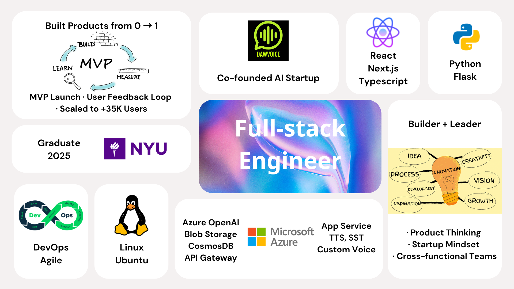

<h1 align="left">Diana Kang - Software Engineer</h1>

###

###

<h2 align="left">🚀 About me</h2>

I'm Diana Kang, a software engineer and technical founder with a passion for building impactful, AI-powered products. With a foundation in full-stack development, cloud architecture, and AI, I enjoy turning ideas into scalable, user-friendly applications. I thrive in fast-paced environments where I can drive product strategy and lead engineering efforts from concept to launch. As a builder and problem-solver, I’m inspired by opportunities that combine creativity with deep technical problem-solving.

  

<h2 align="left">🛠️ Languages and Tools</h2>

              

###

<h2 align="left">🌟 Projects</h2>

###

<h3 align="left">Blabird</h3>

Blabird is an NYU startup project that helps users learn to speak any language more naturally by transforming their voice into the target language while preserving their unique tone and style. As Founder and CTO, I led the end-to-end technical development of the platform, leveraging Azure AI services such as Speech-to-Text and Custom Voice APIs to generate dynamic, personalized dialogues. I also built a scalable ETL pipeline on Azure to process and analyze user speech data, enabling adaptive learning experiences with high performance and low latency. 

- [Demo](https://blabird.vercel.app)
- [Github](https://github.com/dianakang/blabird-vocal-bloom)

###

<h3 align="left">Homi</h3>

Homi is an AI-powered housing platform developed that streamlines the relocation process for students and young professionals by integrating verified listings, roommate matching, and furniture marketplaces. As Tech CEO, I led product development and strategy, building core features including calendar-integrated video calls, logistics coordination, and a personalized housing recommendation engine powered by machine learning and smart search algorithms. 

- [Demo](https://homi-housing.vercel.app/)
- [Github](https://github.com/dianakang/blabird-vocal-bloom)
###

<h2 align="left">📫 Connect with me</h2>

- [LinkedIn](https://www.linkedin.com/in/younjungkang/)
- Email: yk3250@nyu.edu
